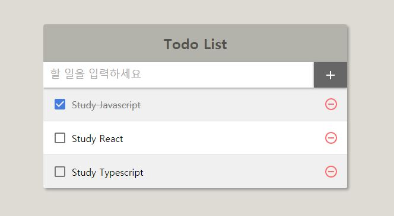

# :ballot_box_with_check: Todo App with React

> '리액트를 다루는 기술 - 김민준(Velopert)지음'으로 학습하며 실습한 코드입니다.

## 구현 결과

<p align="center">
  
</p>

## 학습 내용

- **React Hooks**
  - `useState`
  - `useCallback`
  - `useRef`
  - `useReducer`
- **SCSS**
- 최적화하기
  - 크롬 개발자 도구의 **Performance**탭 사용하기
  - `useState`의 함수형 업데이트
  - **react-virtualized**의 `<List>`
  - `React.memo()`

## 실행 방법

```
$ yarn install
$ yarn start
```

## 참고

- [리액트를 다루는 기술 - 김민준 저](https://m.yes24.com/Goods/Detail/62597469)
